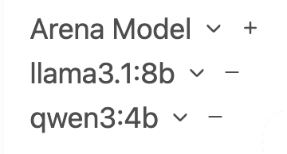
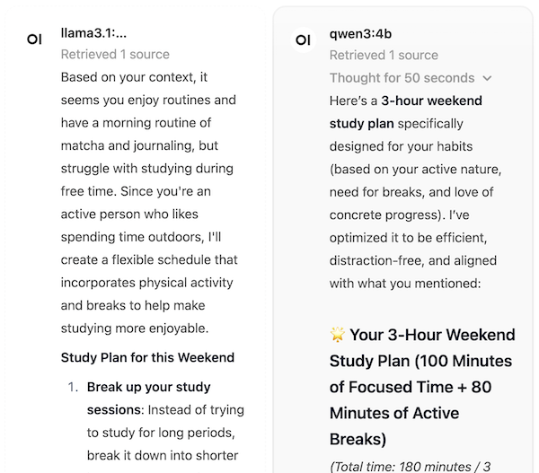

# Local LLM Project

A private, self-hosted AI assistant running entirely on local hardware. No data leaves the machine. Built for personalized learning support and skill development using open source models, retrieval-augmented generation (RAG), and a NAS-backed knowledge base.

---

## Motivation

Most AI assistants are cloud-based — your conversations, documents, and personal data pass through external servers. This project explores what it looks like to run the full stack locally: model inference, a chat interface, and a personal knowledge base, all on a consumer GPU with no external API calls.

The secondary goal is personal: using the system as a learning coach, fed with curated materials and my own writing, to support skill development in software engineering and machine learning.

---

## Architecture

```
NAS (source of truth)
└── llm-project/
    └── knowledge/          ← PDFs, notes, chat exports
           │
           │ mount
           ▼
    Server (GPU)
    ├── Ollama              ← model inference (Llama 3.1 8B)
    └── Docker
        └── Open WebUI      ← chat interface + RAG pipeline
               │
               │ vector search
               ▼
         nomic-embed-text   ← local embeddings
```

**Key design decisions:**
- Everything runs locally — no OpenAI or Anthropic API keys
- NAS stores source documents; Docker volume stores the vector index and chat history
- The model weights and knowledge base are completely independent — swapping models doesn't affect the knowledge base
- SSH tunnel used for remote access instead of exposing ports

---

## Tech Stack

| Tool | Purpose | Why I chose it |
|---|---|---|
| [Ollama](https://ollama.com) | Model serving | Dead simple GPU inference, one command to run any model |
| [Llama 3.1 8B Instruct](https://ollama.com/library/llama3.1) | Base model | Best all-around open model for consumer GPU (<24GB VRAM) |
| [Open WebUI](https://github.com/open-webui/open-webui) | Chat interface + RAG | Built-in RAG, knowledge base management, no code required |
| [nomic-embed-text](https://ollama.com/library/nomic-embed-text) | Embeddings | Local, high quality, runs via Ollama |
| Docker | Container runtime | Isolates Open WebUI with persistent volume storage |
| NAS | Document storage | Network-accessible source of truth for all knowledge base files |

---

## Setup

### Prerequisites
- NVIDIA GPU (tested on consumer RTX series, <24GB VRAM)
- Docker installed
- NAS Synology mounted on server (NFS)
- Ollama installed

### 1. Pull models

```bash
ollama pull llama3.1:8b
ollama pull nomic-embed-text
ollama pull qwen3:4b
```

### 2. Run Open WebUI

```bash
docker run -d \
  -p 3000:8080 \
  --add-host=host.docker.internal:host-gateway \
  -v open-webui:/app/backend/data \
  -v /mnt/nas/llm-project/knowledge:/mnt/knowledge \
  --name open-webui \
  --restart always \
  ghcr.io/open-webui/open-webui:main
```

### 3. Access the UI

```
http://localhost:3000/auth
```

Note: the root `/` route returns a 500 in this version — use `/auth` directly.

### 4. Configure embeddings

In Open WebUI: `Admin Panel → Settings → Documents`
- Embedding Model Engine: `Ollama`
- Embedding Model: `nomic-embed-text`

### 5. Remote access (secure)

```bash
# Run on your local machine
ssh -L 3000:localhost:3000 user@<server-ip>
```

Then access via `http://localhost:3000/auth` — traffic stays inside the SSH tunnel.

---

## Knowledge Base Structure

```
/mnt/nas/llm-project/
├── knowledge/
│   ├── personal/
│   │   ├── chats/          ← cleaned chat exports (ChatGPT, Claude)
│   │   ├── notes/          ← personal writing, reflections
│   │   └── goals.md        ← learning goals and current skill levels
│   └── learning/
│       ├── topic-1/        ← curated materials per topic
│       └── topic-2/
├── backups/                ← Docker volume snapshots
└── README.md
```

### Cleaning chat exports

```python
import json

with open("conversations.json") as f:
    data = json.load(f)

with open("my_chats.txt", "w") as out:
    for convo in data:
        for msg in convo.get("mapping", {}).values():
            m = msg.get("message")
            if m and m.get("content") and m["content"].get("parts"):
                role = m["author"]["role"]
                text = m["content"]["parts"][0]
                if isinstance(text, str):
                    out.write(f"{role.upper()}: {text}\n\n")
```

---

## Data Persistence

| Data | Location | Survives container deletion? |
|---|---|---|
| Chat history | Docker volume (`webui.db`) | Yes |
| Vector index | Docker volume (`vector_db/`) | Yes |
| Source documents | NAS | Yes (independent of Docker) |
| Model weights | `~/.ollama/models/` | Yes (independent of Docker) |

### Backup Docker volume

```bash
docker run --rm \
  -v open-webui:/data \
  -v /mnt/nas/llm-project/backups:/backup \
  alpine tar czf /backup/open-webui-$(date +%Y%m%d).tar.gz -C /data .
```

### Automated weekly backup (cron)

```
0 2 * * 0 docker run --rm -v open-webui:/data -v /mnt/nas/llm-project/backups:/backup alpine tar czf /backup/open-webui-$(date +\%Y\%m\%d).tar.gz -C /data .
0 3 * * 0 find /mnt/nas/llm-project/backups -name "*.tar.gz" -mtime +30 -delete
```

---

## How RAG Works in This Setup

The model itself never "learns" from conversations or documents — its weights are frozen. RAG works by retrieving relevant chunks from the knowledge base at query time and injecting them into the prompt as context. The model reasons over that context to produce a more informed answer.

```
User query
    ↓
Embed query → search vector DB → retrieve relevant chunks
    ↓
Inject chunks into prompt as context
    ↓
Llama generates response
    ↓
Sources cited in UI
```

---

## Experiments & Findings

*This section is updated as experiments are completed.*

| Experiment | Status | Finding |
|---|---|---|
| Model comparison (Llama 3.1 8B vs Qwen 3 4B) | In Progress | — |
| Chunking strategy evaluation | Planned | — |
| RAG evaluation framework | Planned | — |
| QLoRA fine-tuning | Planned | — |


### Experiment 1: Model Comparison (Llama 3.1 8B vs Qwen 3 4B)

**Setup:** Ran identical prompts in Open WebUI Arena mode across three 
categories: technical explanation, learning coaching, and RAG with a 
personal knowledge document.

**Models tested:**
- Llama 3.1 8B Instruct (older, larger)
- Qwen 3 4B (newer, smaller, built-in reasoning)
- Arena for side-by-side comparison



**Key observations:**

| Dimension | Llama 3.1 8B | Qwen 3 4B |
|---|---|---|
| Speed | Faster | Slower (reasoning step adds time) |
| Teaching style | Textbook, structured | Conversational, uses analogies and examples |
| Context usage | Latched onto recent topics | Used most relevant context intelligently |
| RAG reasoning | Inserted retrieved content literally | Evaluated which retrieved content was actionable |
| Math accuracy | Failed basic arithmetic (60+30+10 ≠ 180) | Correctly calculated 100 min focused + 80 min breaks = 3 hours |
| Reasoning transparency | None | Shows "Thought for X seconds" — built-in chain of thought |

**Prompts used:**
1. "Explain how a for loop works in Python as if I'm a beginner"
2. "I keep procrastinating on studying. What strategies would actually help?"
3. "I have 3 hours to study this weekend. How should I split the time 
   between reading and practice?"
4. RAG prompt: "Based on what you know about my study habits, design 
   a study plan for this weekend" (with my-study-habits.txt attached)

**Finding:** For personal coaching and learning use cases, Qwen 3 4B 
consistently outperformed Llama 3.1 8B despite being half the size. 
Qwen's built-in reasoning step produced more personalized, pedagogically 
sound responses ("Your 3-Hour Weekend Study Plan (100 Minutes of Focused Time + 80 Minutes of Active Breaks)"). 
Llama tended toward generic structured answers and made a basic arithmetic error. 

The RAG comparison was the most revealing: both models retrieved the 
same source document, but Qwen filtered it intelligently — omitting 
irrelevant details (my morning matcha routine) and citing specific personal context in its reasoning (built-in walks to the study plan because I mentioned, "I spend time outdoors" and don't have time for long study sessions). 
Llama gave generic feedback: "Since you're an active person who likes to spend time outdoors" ... "simply spend time outside during the day."



**Conclusion:** A newer smaller model can outperform an older larger one 
when the task requires reasoning and personalization rather than raw 
knowledge recall. For this project, Qwen 3 4B is the better fit.

**Next steps:** **Next steps:** Re-run this comparison on a task where knowledge depth 
matters more than reasoning — to test whether Llama's larger size becomes 
an advantage. Separately, re-run the RAG test after adding more personal 
context to the knowledge base to see if richer data narrows or widens the 
gap between models.
---

## What I Learned

- The difference between RAG (context delivery) and fine-tuning (weight modification) — and why confusing them leads to wrong architectural decisions
- How Docker volumes decouple data persistence from container lifecycle
- That model quality on consumer hardware is genuinely good enough for personal productivity use cases
- How embeddings convert text into vectors that enable semantic search. Text gets converted into lists of numbers that capture meaning, so a search for 'improve my coding' can find a document about 'programming practice' even though none of the words match.

---

## Roadmap

- [ ] Model comparison experiment
- [ ] Chunking strategy evaluation
- [ ] Automated RAG evaluation framework
- [ ] QLoRA fine-tune on personal writing corpus
- [ ] GitHub Actions for automated backups

---

## Key Concepts

**RAG (Retrieval-Augmented Generation)** — technique for grounding LLM responses in external documents by retrieving relevant content at query time.

**QLoRA** — parameter-efficient fine-tuning method that trains a small adapter layer on top of frozen model weights, making fine-tuning feasible on consumer GPUs.

**Vector database** — stores document embeddings (numerical representations of text) enabling semantic similarity search.

**Embeddings** — dense numerical representations of text that capture semantic meaning, enabling search by concept rather than keyword.
